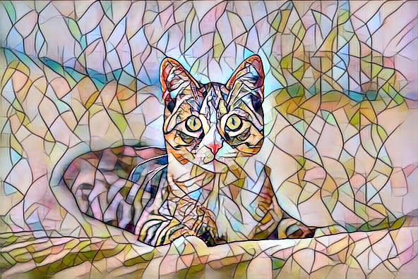

# Pset 4

<!-- START doctoc generated TOC please keep comment here to allow auto update -->
<!-- DON'T EDIT THIS SECTION, INSTEAD RE-RUN doctoc TO UPDATE -->

- [Overview](#overview)
- [New Atomic Write](#new-atomic-write)
- [External Tasks](#external-tasks)
- [Luigi Downloads](#luigi-downloads)
- [Stylizing - Microsciences Approach](#stylizing---microsciences-approach)
- [Submit](#submit)
- [Testing](#testing)

<!-- END doctoc generated TOC please keep comment here to allow auto update -->

## Overview

This assignment was about about developing robust deta processing pipelines with [Luigi](https://luigi.readthedocs.io/en/stable/) and machine learning operations. The end product is a pipeline that downloads an image from [S3](https://docs.aws.amazon.com/s3/index.html) and conducts neural style transfer on it using [pre-trained deep learning models](https://github.com/abhiskk/fast-neural-style).

  

  

## New Atomic Write
The first problem of this assignment was the development of a new atomic write function. This function was written as a Luigi Task to be able to write atomically to an intermediate temporary file with the same extension as the target file. This solution is implemented in [csci_utils package](https://github.com/csci-e-29/2021sp-csci-utils-CalebEverett/blob/ca4cd04ec0f7bc73735c89618c0932da2dbe640b/src/csci_utils/luigi/__init__.py#L45) to be able to use it in other problem sets.

## External Tasks
The next problem was to develop external tasks to verify the existence of files in S3. The original assignment called for two separate tasks, one for an image and one for a pre-trained model, but I ended up consolidating these into a single [S3FileExistsTask](https://github.com/csci-e-29/2021sp-csci-utils-CalebEverett/blob/ca4cd04ec0f7bc73735c89618c0932da2dbe640b/src/csci_utils/luigi/__init__.py#L49) that can be used for both purposes.

## Luigi Downloads
We were also required to develop Luigi tasks to download an image and model from S3 to a local host. I also decided to consolidate these into a single [S3DownloadTask](https://github.com/csci-e-29/2021sp-csci-utils-CalebEverett/blob/ca4cd04ec0f7bc73735c89618c0932da2dbe640b/src/csci_utils/luigi/__init__.py#L67) that can be used to download any file from S3. Both this task and the previous one are parameterized to take an S3 bucket and paths to be generalizable to future problem sets.

## Stylizing - Microsciences Approach
My solution to the stylizing inclues the following functionality:
1. Pytorch models are packaged as [MLflow](https://www.mlflow.org/docs/latest/index.html) models using [package_models.py](https://github.com/csci-e-29/2021sp-pset-4-CalebEverett/blob/master/pset_4/package_models/package_models.py). This downloads the required pre-trained models, loads them as Pytorch models and then saves them as MLflow models.
2. Use [stylize.py](https://github.com/csci-e-29/2021sp-pset-4-CalebEverett/blob/master/pset_4/stylize.py) to call the MLflow models for predictions, pre and post-processing.
3. Create [Dockerfile](https://github.com/csci-e-29/2021sp-pset-4-CalebEverett/blob/master/pset_4/Dockerfile) to create an image with packaged models `stylize.py` module in it.
4. Create a [Stylize](https://github.com/csci-e-29/2021sp-pset-4-CalebEverett/blob/master/pset_4/__init__.py) Luigi Task that builds the image and runs it using the [Docker SDK](https://github.com/csci-e-29/2021sp-pset-4-CalebEverett/blob/master/pset_4/__init__.py), accepting command line arguments, to stylize an image, downloading it from S3 if it exists there but isn't present locally.

A couple of cool features of this set up:
   * Using the Docker SDK to call docker from within the Luigi task avoids having to use an external task.
   * Using the Docker feature of treating additional arguments passed to the run command beyond those specified in the entry point is an easy way to be able to pass additional arguments to the stylize module inside the container.
   * Packaging the models inside the Docker container as the image is being built, completely encapsulates them. Having the models be in the MLflow format in addition to being inside a Docker container is probably overkill, but was useful to gain experience with both approaches.
   * The Stylize task calls for the image to be built every time it is run, to make sure that it exits before calling it to stylize an image, but if it exists, Docker won't rebuild it again.

## Submit
Submitting the quiz required uploading a file. The canvasapi uploader class was broken. I added a [file upload method](https://github.com/csci-e-29/2021sp-csci-utils-CalebEverett/blob/ca4cd04ec0f7bc73735c89618c0932da2dbe640b/src/csci_utils/canvas_utils/__init__.py#L281) to my SubmissionManager class in csci_utils using [requests](https://docs.python-requests.org/en/master/) to access the [Canvas REST API](https://canvas.instructure.com/doc/api/) directly.

## Testing
All of the above functionality is fully tested, including the model packaging code.
* The [file upload method test](https://github.com/csci-e-29/2021sp-csci-utils-CalebEverett/blob/ca4cd04ec0f7bc73735c89618c0932da2dbe640b/src/csci_utils/canvas_utils/tests.py#L264) mocks the Canvas Api for the required multi-step post process.
* The tests for the [S3 Luigi tasks](https://github.com/csci-e-29/2021sp-csci-utils-CalebEverett/blob/ca4cd04ec0f7bc73735c89618c0932da2dbe640b/src/csci_utils/luigi/tests.py#L67) mock the S3 api
* While most of the functionality called in the Stylize task consists of composed functions tested elsewhere, [the test](https://github.com/csci-e-29/2021sp-pset-4-CalebEverett/blob/e1ee5859eee7e96242662d28001165dd3e63ea76/tests/test_pset.py#L19) is a full cycle from downloading an image all the way through to stylizing. The final test takes a hash of the stylized image and asserts it is equal to a known hash value.
* Includes [testing of model packaging and stylizing code](https://github.com/csci-e-29/2021sp-pset-4-CalebEverett/blob/e1ee5859eee7e96242662d28001165dd3e63ea76/tests/test_pset.py#L53) in similar manner with the final test being of a hash of the stylized image.
